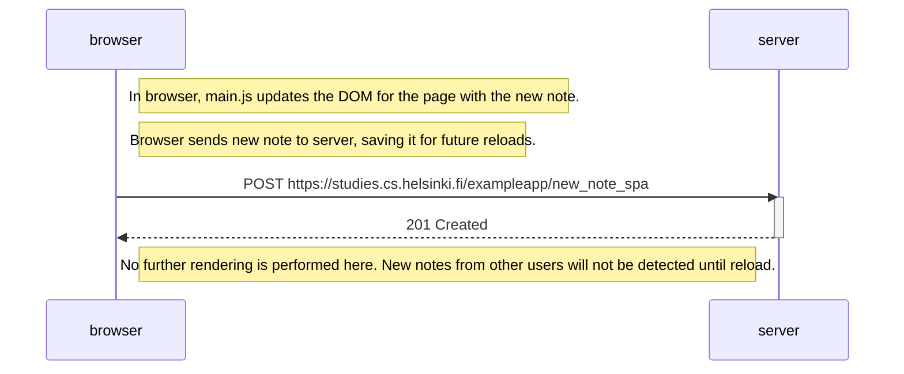

```mermaid
sequenceDiagram
    participant browser
    participant server

    Note right of browser: In browser, main.js updates the DOM for the page with the new note.

    Note right of browser: Browser sends new note to server, saving it for future reloads.

    browser->>server: POST https://studies.cs.helsinki.fi/exampleapp/new_note_spa
    activate server
    server-->>browser: 201 Created
    deactivate server

    Note right of browser: No further rendering is performed here. New notes from other users will not be detected until reload.
```